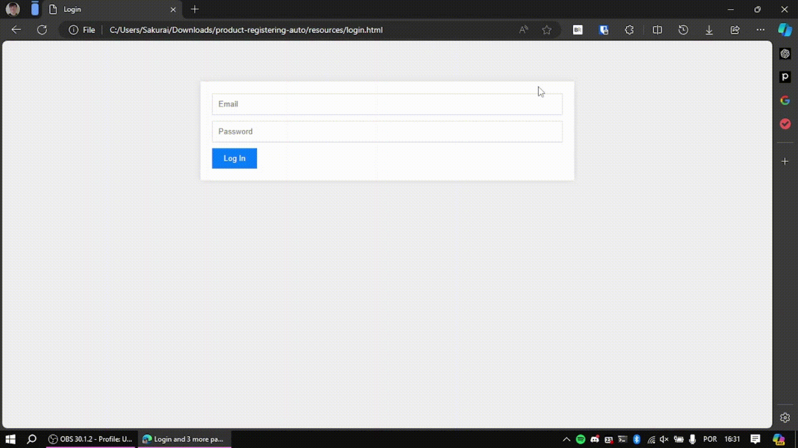
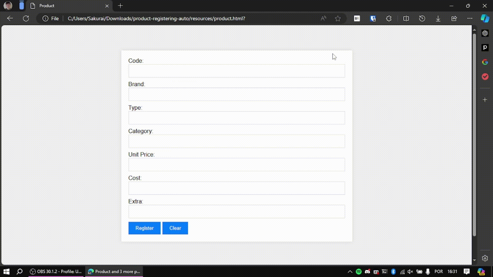
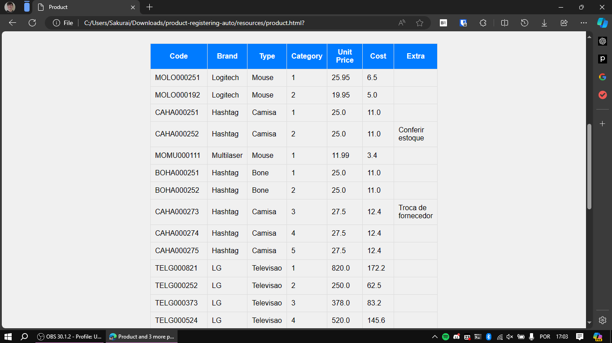

<h1 align="center">  ⚙️  Automation: Product Registering in CRUD  ⚙️  </h1>

An automation project that reads a CSV file and registers products in a system. The libraries used in this project were:
- Pandas: for handling the CSV;
- PyAutoGUI: for handling GUI manipulation;

## 🗺️ Steps

### 🖥️ Open browser

### 🌐 Open website

### 🔑 Login

### 📝 Register products

## 📊 End Result

You can see the registered products in the table below the form:

